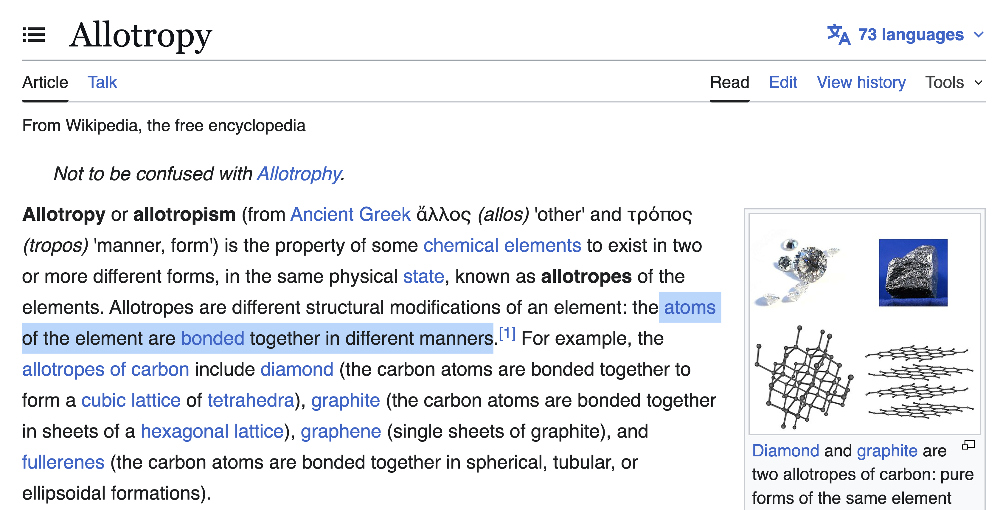

# Allotropy

> The same ATOM, in different forms.

**Allotropy** is a CosmWasm smart contract that brings **liquid bonding curves** to the Cosmos ecosystem. It combines the capital-efficient price discovery of bonding curves with Cosmos-native liquid staking, 

Unlike traditional bonding curves, Allotropy tries addressing the issue of capital efficiency by staking the reserve, while still enjoying instantaneous and liquid nature of bonding curves. To achieve this, Allotropy operates over different types of ATOM (native and liquid staked) and binds them as if they were one



## How It Works

### Buy Flow

1. User sends `$ATOM` to the contract
2. Commission is taken (if configured)
3. Remaining ATOM is staked to a validator via `StakingMsg::Delegate`
4. New tokens are minted according to the current bonding curve
5. User can see his balance using cw20 interface (or as a native token in a future tokenfactory implementation) 

### Sell Flow (Liquid Unbond)

1. User calls `Sell` with the amount of tokens to sell
2. Tokens are burned from the user's balance and removed from the total supply
3. The bonding curve calculates how much native ATOM should be released
4. The contract attempt to find regulat free ATOM that might have got accumulated from staking rewards or other sources like deliberate deposits by governing entity
5. If there is not enough free ATOM, the contract will ask the chain to issue tokenised shares directly to the user
6. The user can keep the tokenized shares and claim the rewards or initiate the unbonding process releasing tokens directky to the user (after 21 days) without any intermediaries.

## Why Bonding Curves + Liquid Staking?

Traditional bonding curves give instant liquidity and fair price discovery but usually require the reserve to sit idle. Allotropy solves this by **staking the reserve**, while still allowing users to exit instantly through Cosmos liquid staking primitives.

This creates a powerful new primitive: **liquid staked bonding curve tokens**.


## Testing & Local Development

This is a monorepo with everything centered in the project root. Follow these steps:

1. **Build Contracts:** Build the smart contracts using the optimizer:
   ```bash
   make optimize
   ```

2. **Configure Connection:** Set up a connection to a local Cosmos chain:
   ```bash
   make local-chain
   ```

3. **Deploy Artifacts:** Upload `artifacts/cw20_liquid_bond.wasm` to the chain (see `scripts/store.sh`).
   *(Note: For a funded wallet, run `gaiad keys add t --recover` and paste a mnemonic from `config/accounts.json`.)*

4. **Install Dependencies:**
   ```bash
   bun install
   ```

5. **Run Tests & Interface:**
   - Run tests: `bun test`
   - Start UI: `bun run dev`


## Footnote

The website demo page demonstrated the behavior and simulation opportunities related to bonding curves. At the moment it operates over mock values albeit realisitc ones. Finishing it is requiring more time so it goes ourside of the scopes for the hackathon submission

### Acknowledgements

- [Confio + other maintainers](https://github.com/cosmwasm/cw-tokens/) behind `cw-tokens` repository that provided battle-tested snippets for the main functionality of tokens, for on-chainn staking and for bonding curves

- [Dynamic Bonding Curve for burn-and-mint token model](https://medium.com/sotuu/dynamic-bonding-curve-d91ea46d5f0f) - Short but concise math-oriented article explaining and visualising the bonding curve movements

- [Token Bonding Curves](https://www.blockchaintalks.io/media/event_files/Token_Bonding_Curves.pdf) - Simple slides but with great visualisation of curve "movements"


- [Grok](https://grok.com) - The best helper when it comes to research with knowledge span over multiple different protocols and ecosystems. The only ono whom I know undesranding both Solana's launchpads like Pumps.fun and big ecosystem of Base protocols at the same time


- [Claude](https://www.claude.ai) - Assistance in software design and major help in the implementation process. Doesn't know CosmWasm that well but can be guided to be useful in the right hands